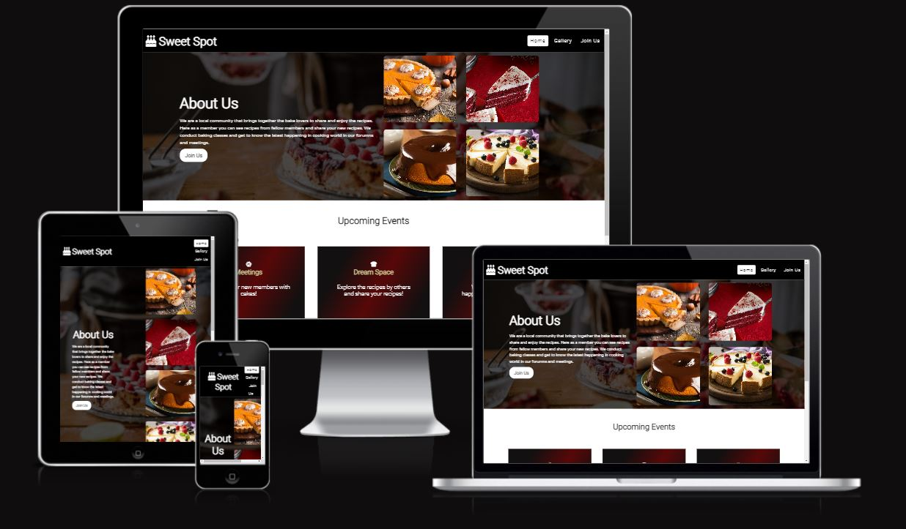
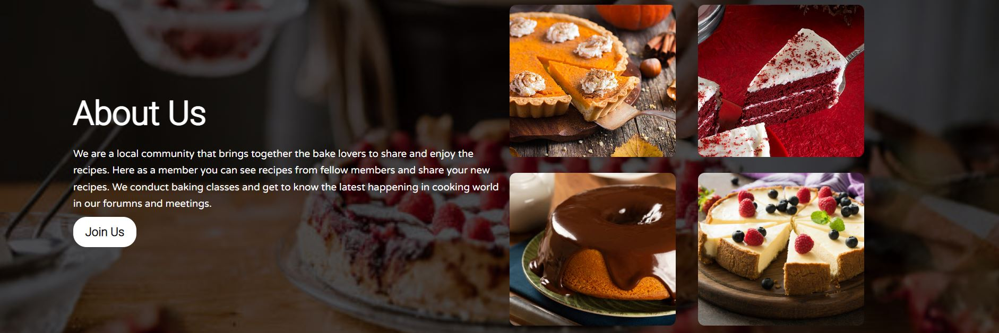
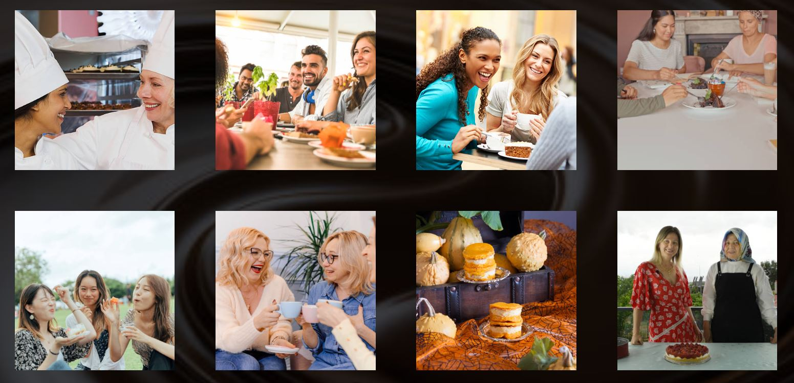
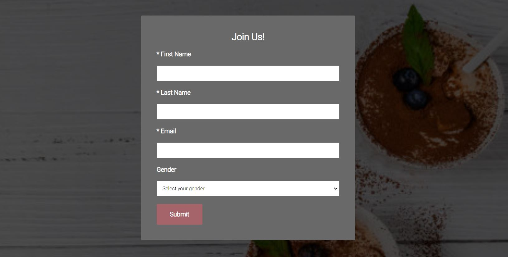

# **Sweet Spot**

[Click here to view the live project](https://amrutha2103.github.io/sweet-spot/)

Sweet Spot is a website for a cake baking community where cake decorators and bakers share cake photos, cake decorating tips, and cake recipes. 

The site brings together cake lovers to share in the love of cake decorating and help one another learn. Sweet Spot is a place to discuss and share baking recipes with people of similar interest.

 ## **Features**

- Navigation Bar

    * All the pages of the website are provided with a fully responsive navigation bar for easy navigation that contains links to the Logo, Home page, Gallery page and Join US page.
    * The navigation tells the user the name of the website and navigation to each sections of the website.
    * The navigation is provided with a font color that contrasts with the background for easy visibility.

- About Us section

    * This section describes what the website is for and a small description of the activities for the users.
    * The About Us section is displayed with the images of lovely cakes prepared by the baking community and the images are provided a hover effect.
    * This section also includes a button which on clicking is redirected to the "Join Us" page of the website and the users can sign up.

- Upcoming Events section

    * This section describes the events that happen for the baking community.
    * The upcoming events for the community are Meetings for the members, a dream space to share the recipes and discussions between members of the latest happenings.

- Footer section

    * The footer section allows the user to get connected with the Sweet Spot via social media.
    * The footer is provided with different links to the social media sites for Sweet Spot and each of these links opens to a new tab.

- Gallery Page

    * The gallery page includes many images of the Sweet Spot and it shows the users the various events that took place in the community.
    * The images in the gallery page are displayed in a grid view with a dark background.

 

 - Join Us Page

    * The Join Us page allows the user to sign up to the application and join the Sweet Spot community.
    * The page has a form to collect the information of the user which included firstname, lastname, email and gender of the user and a submit button to submit the information entered.

 

  ## **Testing**

  - I tested the website on different browsers like Chrome, Firefox and Edge.
  - I confirmed that all the texts included are readable and the images are visible.
  - I confirmed that the website is responsive and looks good on all standard screen sizes. 
  - I confirmed that all links provided are clickable and are redirected to a new page.
  - I tested the sign up form and it works well with the submit action for the submit button.

  ### **Validator Testing** 

  - HTML
    * No errors were returned when passing through the official W3C validator.
  - CSS
    * No errors were found when passing through the official (Jigsaw) validator.
  - Accessibility

